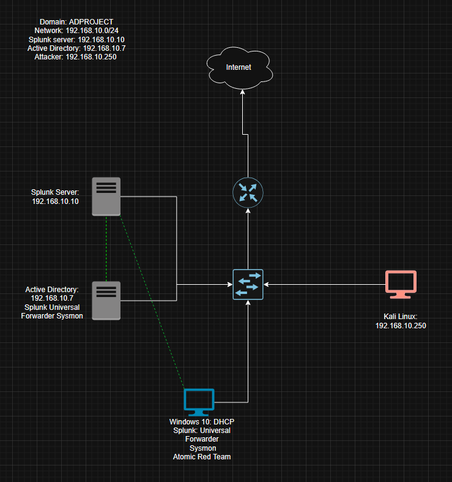
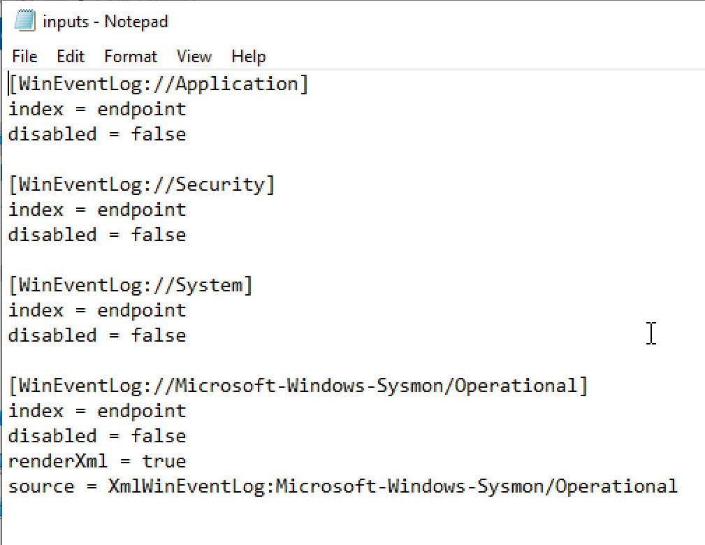
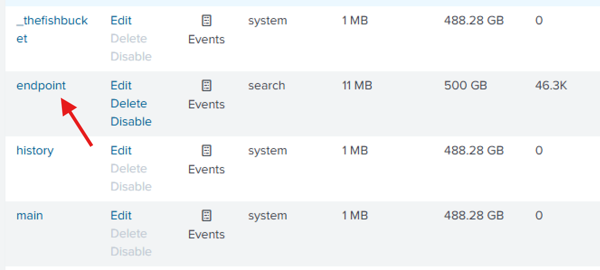

# Active Directory Project

In this project, I used Virtual Box to setup an AD environment inside a Windows Server 2022 VM, Configured a target Windows 10 machine and Kali Linux VM, and a Splunk instance for ingesting events and analyzing telemetry. The initial draw up, with all VM's and installed software, is depicted below:

After setting up a NAT network in Virtual Box so my vm's could communicate with each other/access the internet, I configured a static IP address for the Splunk server:

Once I installed sysmon and Splunk Universal Forwarder on the Windows 10 target VM and Windows Server 2022 AD VM, it was time to create an inputs.conf file in the local directory of the Universal Forwarder to send Application, Security, System and Sysmon logs to the Splunk server, pointing to the index "endpoint" as well as creating an endpoint index within Splunk and configuring a receving point, which is 9997 by default: 

