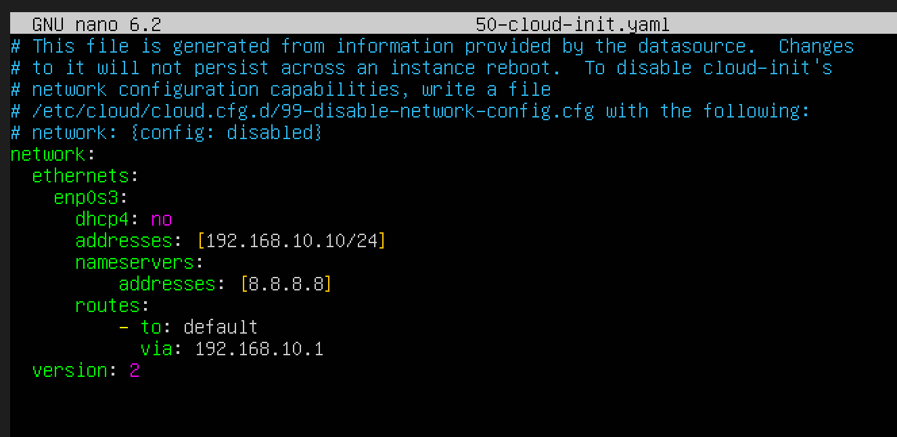

# Active Directory Project

In this project, I used Virtual Box to setup an AD environment inside a Windows Server 2022 VM, Configured a target Windows 10 machine and Kali Linux VM, and a Splunk instance for ingesting events and analyzing telemetry.

After setting up a NAT network in Virtualbox so my vm's could communicate with each other/access the internet, I configured a static IP address for the splunk server:

